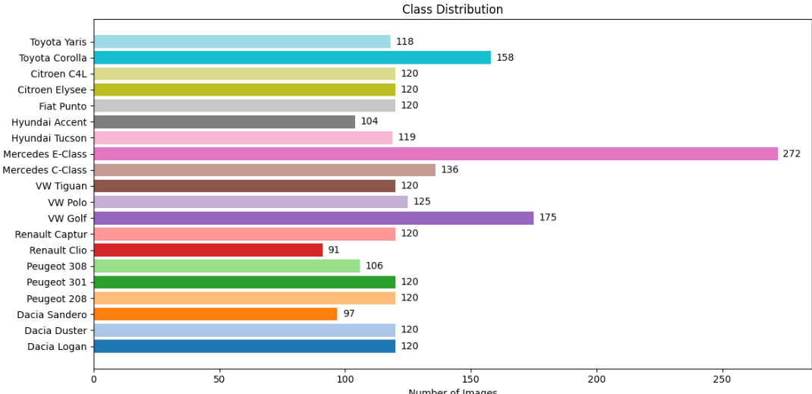
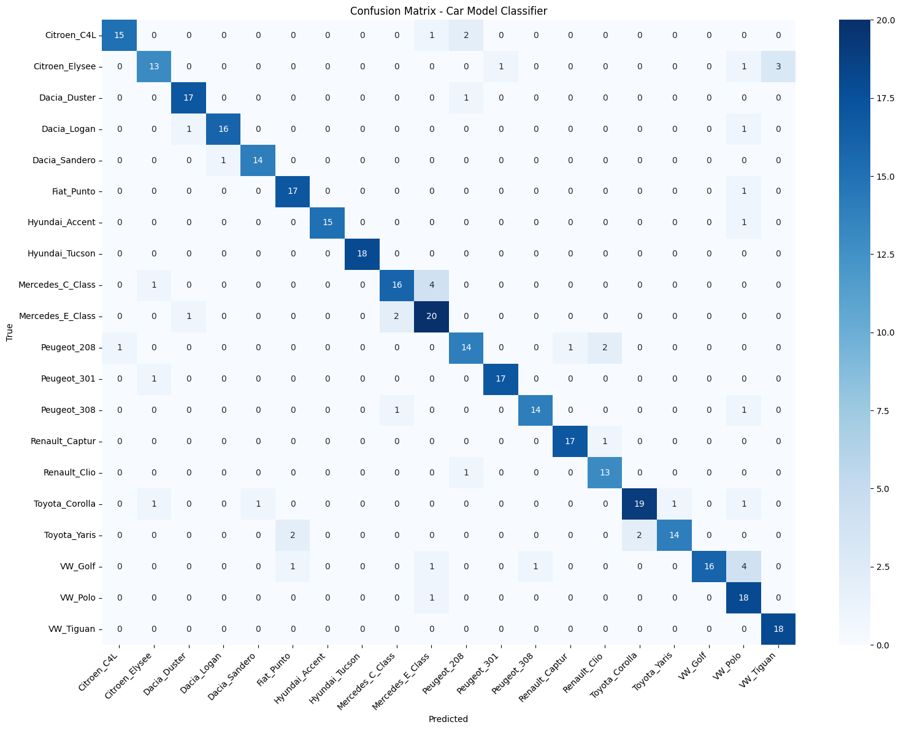

# Stage 0 — Car Classifier

Identifies which of the 20 Moroccan-market car models appears in the photo, and maps it to a repair **tier** (economy / mid-range / premium) that drives part and labour costs downstream.

Module: `src/car_damage_morocco/stage0_classifier.py`.

---

## Dataset

### The problem with existing datasets

Most open car-classification datasets are built around the **American market** — packed with Ford F-150s, Chevrolet Silverados, and Dodge Rams that are virtually absent from Moroccan roads. Training on them would give a model that confuses a Dacia Logan with a Dodge Charger, which is useless for a Moroccan insurance claim.

### Why CompCars

We used the **CUHK CompCars Dataset** (a large-scale Chinese/European car dataset) as our source and filtered it down to the 20 models that are actually common in Morocco:

- **Dacia** family (Logan, Sandero, Duster) — the most sold brand in Morocco by volume
- **Renault** (Clio, Captur) — same group as Dacia
- **Peugeot** (208, 301, 308)
- **Citroën** (C4L, Elysée)
- **Volkswagen** (Golf, Polo, Tiguan)
- **Hyundai** (Accent, Tucson)
- **Toyota** (Yaris, Corolla)
- **Mercedes** (C-Class, E-Class) — premium segment
- **Fiat Punto**

After filtering and cleaning, the dataset contains **~2 581 images** across 20 classes.

### Class distribution



The dataset is **mildly imbalanced**. Most classes sit around 120 images, but:

| Outlier | Count | Reason |
|---|---|---|
| Mercedes E-Class | **272** | Largest source pool in CompCars |
| Renault Clio | **91** | Fewer matching images found |
| Dacia Sandero | **97** | Similar |

We did **not** artificially up-sample rare classes offline — instead we used on-the-fly augmentation and class-weighted loss to compensate.

---

## Why EfficientNetB0 (not ResNet)

We first tried **ResNet-50**. Results were poor — the model underfitted, struggled to separate visually similar cars (VW Golf vs Polo, Mercedes C vs E), and the validation accuracy plateaued well below acceptable.

The core issue: ResNet-50 was designed for ImageNet-scale data (~1.2 M images). With ~120 images per class, it has far more parameters than data to justify them.

**EfficientNetB0** was the right switch:

| | ResNet-50 | EfficientNetB0 |
|---|---|---|
| Parameters | ~25 M | **~5.3 M** |
| Designed for | Large datasets | **Efficient scaling** |
| Top-1 ImageNet | 76 % | **77.1 %** (with fewer params) |
| Behaviour on small data | Overfit / underfit | Generalises well |
| Preprocessing | Manual normalize | **Built-in** |

EfficientNetB0's compound scaling (width × depth × resolution jointly) means it extracts richer features than ResNet-50 at a fraction of the parameter count — exactly what you want on a small per-class dataset.

---

## Why on-the-fly augmentation

We chose **on-the-fly (runtime) augmentation** rather than pre-generating an augmented dataset on disk.

| Approach | On-the-fly | Pre-generated |
|---|---|---|
| Disk space | ✅ No extra storage | ❌ 5–10× dataset size on disk |
| Variety per epoch | ✅ Different random transforms every epoch | ❌ Same fixed copies seen repeatedly |
| Overfitting risk | ✅ Lower — model never sees the exact same image twice | ❌ Higher |
| Implementation | ✅ Keras `ImageDataGenerator` / layers | Requires offline script |
| Kaggle T4 time | ✅ Negligible CPU overhead | ❌ Extra preprocessing job |

With ~2 500 images total, pre-generating 10× augmentations would give 25 000 files — but the model would still see each unique base image repeated across epochs. On-the-fly augmentation gives genuine variety: every batch is different.

Augmentation policy applied (Phase 3):

```python
rotation_range      = 20
width_shift_range   = 0.15
height_shift_range  = 0.15
shear_range         = 0.1
zoom_range          = 0.15
horizontal_flip     = True
brightness_range    = [0.8, 1.2]
fill_mode           = 'nearest'
```

---

## Model architecture

```
EfficientNetB0 (ImageNet pretrained)
    └─ GlobalAveragePooling2D
    └─ BatchNormalization
    └─ Dropout(0.4)
    └─ Dense(256, activation='relu', kernel_regularizer=L2(0.01))
    └─ Dropout(0.3)
    └─ Dense(20, activation='softmax')
```

| Input | `(224, 224, 3)` uint8 in `[0, 255]` |
|---|---|
| Preprocessing | **None** — EfficientNetB0 handles normalisation internally |
| Output | Softmax over 20 classes (alphabetically sorted) |
| Weights file | `models/stage0/best.keras` |

!!! note "Why raw uint8 — not float [0, 1]"
    EfficientNetB0 in TF/Keras includes a built-in normalisation layer inside the backbone. Passing pre-normalised floats `[0, 1]` would **double-normalise** and destroy accuracy. We pass raw uint8 in `[0, 255]` and let the backbone handle it.

---

## Training (3 phases, Kaggle T4)

| Phase | Backbone | Epochs | Optimiser | LR | Notes |
|---|---|---|---|---|---|
| 1 | **Frozen** | 20 | Adam | 1e-3 | Head-only training — learns basic car features fast |
| 2 | Last **30 layers** unfrozen | 30 | Adam | 1e-4 | Light fine-tune — adapts deeper features to our domain |
| 3 | **Fully unfrozen** | 40 | Adam | 1e-4 | Heavy aug + label smoothing 0.1 — final convergence |

This progressive unfreezing strategy prevents catastrophic forgetting of ImageNet features while allowing the full network to specialise on Moroccan car makes.

Notebook: [`stage0_car_classifier.ipynb`](../notebooks.md).

---

## Results

### Final test metrics

| Metric | Value |
|---|---|
| **Test Accuracy** | **87.23 %** |
| Test Loss | 2.62 |
| Macro avg F1 | 0.88 |
| Weighted avg F1 | 0.87 |

### Per-class report

| Class | Precision | Recall | F1 | Support |
|---|---|---|---|---|
| Citroen_C4L | 0.94 | 0.83 | 0.88 | 18 |
| Citroen_Elysee | 0.81 | 0.72 | 0.76 | 18 |
| Dacia_Duster | 0.89 | 0.94 | 0.92 | 18 |
| Dacia_Logan | 0.94 | 0.89 | 0.91 | 18 |
| Dacia_Sandero | 0.93 | 0.93 | 0.93 | 15 |
| Fiat_Punto | 0.85 | 0.94 | 0.89 | 18 |
| Hyundai_Accent | 1.00 | 0.94 | **0.97** | 16 |
| Hyundai_Tucson | 1.00 | 1.00 | **1.00** | 18 |
| Mercedes_C_Class | 0.84 | 0.76 | 0.80 | 21 |
| Mercedes_E_Class | 0.74 | 0.87 | 0.80 | 23 |
| Peugeot_208 | 0.78 | 0.78 | 0.78 | 18 |
| Peugeot_301 | 0.94 | 0.94 | 0.94 | 18 |
| Peugeot_308 | 0.93 | 0.88 | 0.90 | 16 |
| Renault_Captur | 0.94 | 0.94 | 0.94 | 18 |
| Renault_Clio | 0.81 | 0.93 | 0.87 | 14 |
| Toyota_Corolla | 0.90 | 0.83 | 0.86 | 23 |
| Toyota_Yaris | 0.93 | 0.78 | 0.85 | 18 |
| VW_Golf | 1.00 | 0.70 | 0.82 | 23 |
| VW_Polo | 0.64 | 0.95 | **0.77** | 19 |
| VW_Tiguan | 0.86 | 1.00 | 0.92 | 18 |
| **macro avg** | **0.89** | **0.88** | **0.88** | 368 |
| **weighted avg** | **0.88** | **0.87** | **0.87** | 368 |

### Confusion matrix



**Key observations from the confusion matrix:**

- **Hyundai Tucson** — perfect: 18/18, no errors
- **VW Tiguan** — perfect: 18/18
- **Mercedes C ↔ E Class** — the hardest pair: 4 C-Class images predicted as E-Class. Visually very similar sedans — expected and acceptable
- **VW Golf → Polo** — 4 Golf images predicted as Polo. Both are compact VWs with similar silhouettes
- **VW Polo precision (0.64)** — several other compacts are misclassified *as* Polo, but when the true class is Polo, the model identifies it (recall 0.95)
- **Citroen Elysee** — lowest F1 (0.76): some confusion with Citroen C4L. Both are Citroën sedans sold in Morocco with similar proportions

---

## Classes (20)

Class indices `0..19` are alphabetical, frozen in [`data/stage0_classes.json`](https://github.com/hamzafgh/car-damage-morocco/blob/main/data/stage0_classes.json):

`Citroen_C4L` · `Citroen_Elysee` · `Dacia_Duster` · `Dacia_Logan` · `Dacia_Sandero` · `Fiat_Punto` · `Hyundai_Accent` · `Hyundai_Tucson` · `Mercedes_C_Class` · `Mercedes_E_Class` · `Peugeot_208` · `Peugeot_301` · `Peugeot_308` · `Renault_Captur` · `Renault_Clio` · `Toyota_Corolla` · `Toyota_Yaris` · `VW_Golf` · `VW_Polo` · `VW_Tiguan`

---

## API

```python
from car_damage_morocco.stage0_classifier import CarClassifier

clf = CarClassifier(
    weights_path="models/stage0/best.keras",
    classes_json="data/stage0_classes.json",
)
result = clf.predict(image_bgr_or_rgb, top_k=3)
```

Returns:

```python
{
    "label":         "Dacia_Logan",
    "display_label": "Dacia Logan",
    "confidence":    0.94,
    "topk": [
        ("Dacia_Logan",   0.94),
        ("Dacia_Sandero", 0.04),
        ("Peugeot_208",   0.01),
    ],
}
```

---

## What the output feeds

The `label` is the key the [Pricing](pricing.md) module uses to look up the **tier** in [`car_model_tiers.json`](https://github.com/hamzafgh/car-damage-morocco/blob/main/data/car_model_tiers.json):

| Tier | Cars |
|---|---|
| **economy** | Dacia Logan · Dacia Sandero · Dacia Duster · Peugeot 208 · Peugeot 301 · Hyundai Accent · Toyota Yaris · Fiat Punto · Citroën Elysée · Renault Clio |
| **mid_range** | VW Golf · VW Polo · VW Tiguan · Peugeot 308 · Renault Captur · Hyundai Tucson · Citroën C4L · Toyota Corolla · Mercedes C-Class |
| **premium** | Mercedes E-Class |

The tier doesn't change *which* repairs are needed — only how much they cost. A bumper replacement on a Mercedes E-Class costs more in parts and labour than the same repair on a Dacia Logan.
