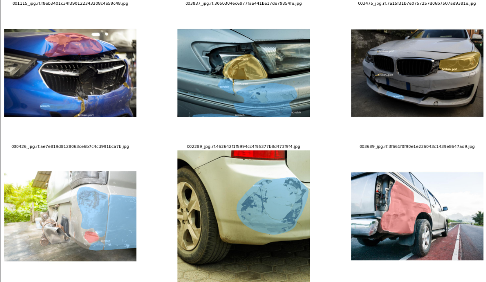
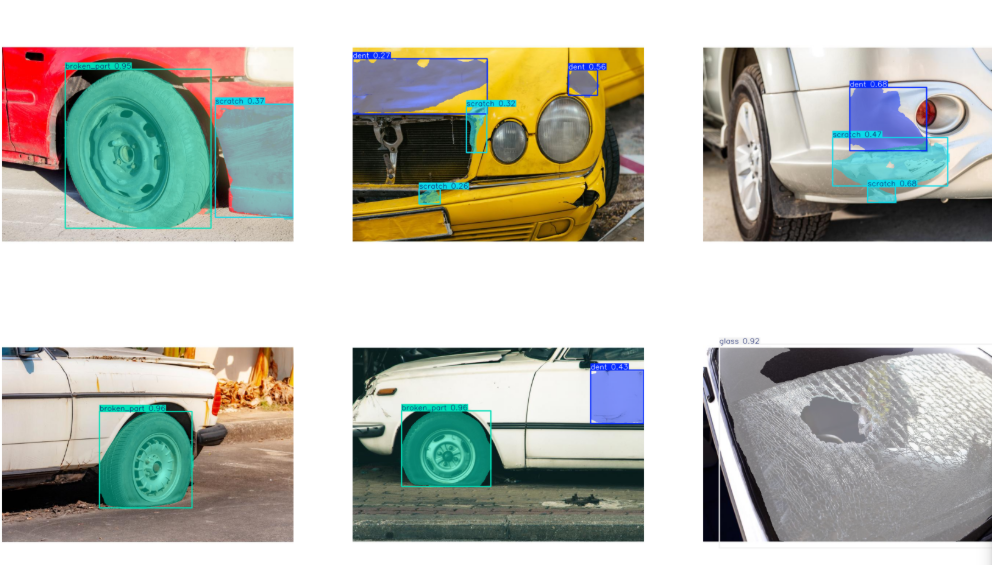
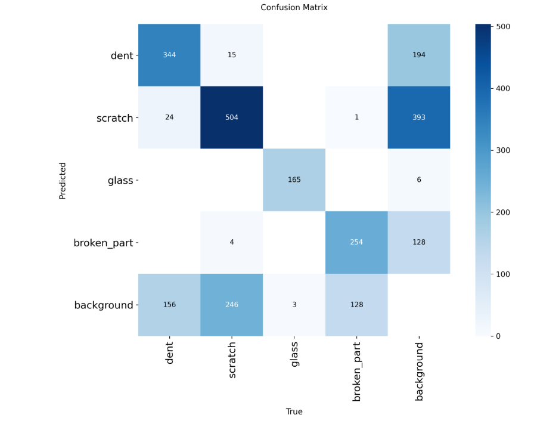

# Stage 2 — Damage Segmentation

Segments **4 damage types** on the input photo using YOLOv8s-seg, producing a pixel mask and confidence score for every damage region found.

Module: `src/car_damage_morocco/stage2_damage.py`.

---

## The 4 damage classes

| ID | Class | French | Recommended action |
|---|---|---|---|
| 0 | `dent` | enfoncement | Repair (débosselage) |
| 1 | `scratch` | rayure | Repair (peinture) |
| 2 | `glass` | bris de vitre | Replace |
| 3 | `broken_part` | casse | Replace |

---

## Dataset

### Source: Roboflow `is_it_damaged` v6

We used the **Roboflow `is_it_damaged` v6** dataset, a large crowd-sourced collection of damaged car images with polygon annotations.

The original dataset ships with **7 classes**. Several of these are semantically overlapping (e.g. a crack on a window is labelled differently from a crack on a body panel). We collapsed them into **4 clean classes** by rewriting every YOLO label file in train/val/test before training:

| Original classes | → Remapped to |
|---|---|
| `dent`, `depression` | `dent` |
| `scratch`, `paint_damage` | `scratch` |
| `broken_glass`, `crack` (on glass) | `glass` |
| `broken_part`, `crack` (on body) | `broken_part` |

This remapping happens **before** the YAML is written, so the model only ever sees a 4-class universe — no post-processing needed at inference time.

### Sample images from the dataset



The dataset covers a wide range of real-world conditions: different lighting, car colors, damage severity, and camera angles. This diversity is intentional — insurance claim photos are taken by non-expert drivers in uncontrolled environments.

---

## Model

| Property | Value |
|---|---|
| Architecture | **YOLOv8s-seg** (Ultralytics) |
| Starting weights | `yolov8s-seg.pt` (COCO pretrained) |
| Source dataset | Roboflow `is_it_damaged` v6 (7 → 4 classes) |
| Input size | 640 × 640 |
| Classes | 4 |
| Weights file | `models/stage2/best.pt` |

---

## Training (Kaggle T4)

The training notebook (`stage2_damage_seg_train.ipynb`) does three things:

1. **Downloads** the Roboflow dataset via API key.
2. **Remaps** 7 original classes → 4 by rewriting every `.txt` label file in train / val / test.
3. **Trains** YOLOv8s-seg with strong augmentation.

Notebook: [`stage2_damage_seg_train.ipynb`](../notebooks.md).

---

## Results

We report two evaluation sets:

- **Validation set** — 852 images, 1 844 instances (seen during training for early stopping)
- **Test set** — 400 images, 888 instances (held out, never seen during training)

### Validation set

| Class | Images | Instances | Box mAP50 | Mask P | Mask R | Mask mAP50 | Mask mAP50-95 |
|---|---|---|---|---|---|---|---|
| **all** | 852 | 1 844 | 0.733 | 0.756 | 0.693 | **0.729** | 0.528 |
| dent | 363 | 524 | 0.644 | 0.696 | 0.598 | 0.648 | 0.354 |
| scratch | 440 | 769 | 0.601 | 0.627 | 0.581 | 0.598 | 0.305 |
| **glass** | 166 | 168 | **0.993** | **0.968** | **0.982** | **0.993** | **0.952** |
| broken_part | 264 | 383 | 0.693 | 0.731 | 0.611 | 0.676 | 0.499 |

### Test set (held out)

| Class | Images | Instances | Box mAP50 | Mask P | Mask R | Mask mAP50 | Mask mAP50-95 |
|---|---|---|---|---|---|---|---|
| **all** | 400 | 888 | 0.726 | 0.769 | 0.662 | **0.714** | 0.507 |
| dent | 156 | 224 | 0.607 | 0.676 | 0.518 | 0.592 | 0.332 |
| scratch | 219 | 383 | 0.578 | 0.615 | 0.521 | 0.560 | 0.268 |
| **glass** | 58 | 59 | **0.985** | **0.981** | **0.983** | **0.985** | **0.912** |
| broken_part | 152 | 222 | 0.734 | 0.797 | 0.622 | 0.708 | 0.498 |

**Reported metric: test mask mAP50 = 0.714**

### Detection examples



---

## Confusion matrix



### Reading the matrix

| Observation | Numbers | Explanation |
|---|---|---|
| **Glass is nearly perfect** | 165/171 correct, only 6 → background | Glass breakage has a very distinctive visual signature (shattered pattern, reflections) — the model learned it with almost no errors |
| **Dent → background** is the biggest miss | 194 dent instances predicted as background | Shallow dents are subtle — low contrast against the car body, especially under uniform lighting |
| **Scratch → background** is equally hard | 393 scratch instances predicted as background | Fine scratches are hard to segment precisely — the model finds them (recall ~0.52) but misses the faint ones |
| **Dent ↔ Scratch confusion is low** | Only 15 dent→scratch, 24 scratch→dent | The two classes are visually well-separated: dents have depth/shadow, scratches are linear surface marks |
| **Broken_part → background** | 128 instances missed | Broken parts vary a lot in appearance — a missing bumper corner looks very different from a cracked door trim |
| **Background false positives** | 156 bg→dent, 246 bg→scratch | The model over-detects on background regions that have shadow or texture — a known challenge in damage segmentation |

---

## Why dent and scratch are harder than glass

Dents and scratches are **surface-level deformations** — their appearance changes completely with lighting angle, car color, and camera position. A dent on a black car under direct sun looks nothing like the same dent on a white car in shade.

Glass breakage has a **structural signature** (fracture patterns, missing glass, translucency changes) that is much more lighting-invariant. This is why glass achieves 0.985 mAP50 while dent only reaches 0.592.

In a production system this would be addressed with:
- More diverse dent/scratch training data under different lighting conditions
- Test-time augmentation (TTA)
- A dedicated confidence threshold per class (lower threshold for dents to catch subtle ones)

---

## Overlay colors

Each class has a distinct color in the Streamlit dashboard's annotated image:

| Class | Color | 
|---|---|
| `dent` | Red |
| `scratch` | Yellow / Cyan |
| `glass` | Cyan |
| `broken_part` | Dark red / Pink |

---

## Confidence threshold

The default threshold is `0.25`, exposed in the Streamlit Inspection page's **"Paramètres de détection"** expander.

- **Lower it** (e.g. 0.15) to catch faint scratches and shallow dents — more detections, more false positives
- **Raise it** (e.g. 0.4) to show only high-confidence damage — fewer detections, fewer false positives

In an insurance production setting, the threshold would be calibrated separately per class against a precision/recall budget.

---

## API

```python
from car_damage_morocco.stage2_damage import DamageSegmenter, DamageDetection

seg = DamageSegmenter(
    weights_path="models/stage2/best.pt",
    classes_json="data/stage2_classes.json",
)
damages: list[DamageDetection] = seg.predict(image_bgr, conf=0.25, imgsz=640)
```

Each `DamageDetection`:

```python
@dataclass
class DamageDetection:
    class_id:   int
    class_name: str         # 'dent' | 'scratch' | 'glass' | 'broken_part'
    confidence: float
    bbox:       tuple[int, int, int, int]   # (x1, y1, x2, y2) pixel coords
    mask:       np.ndarray                  # bool array, shape (H, W)
```

Masks are resized to the **original image resolution** so they align exactly with Stage 1 output for pixel-level fusion.

---

## What the output feeds

The list of `DamageDetection`s goes into [Fusion](fusion.md), which pairs each damage mask with the car part it overlaps — using **IoMin** as the overlap metric — to produce a final `DamageRecord` with part name, damage type, and repair cost.
