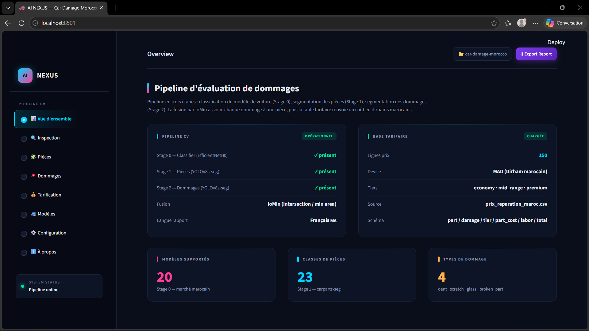
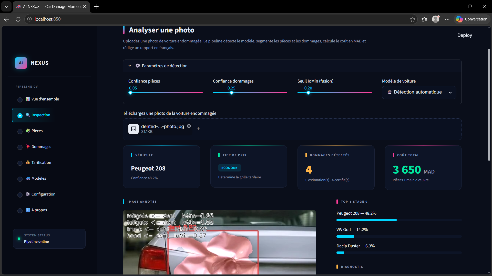
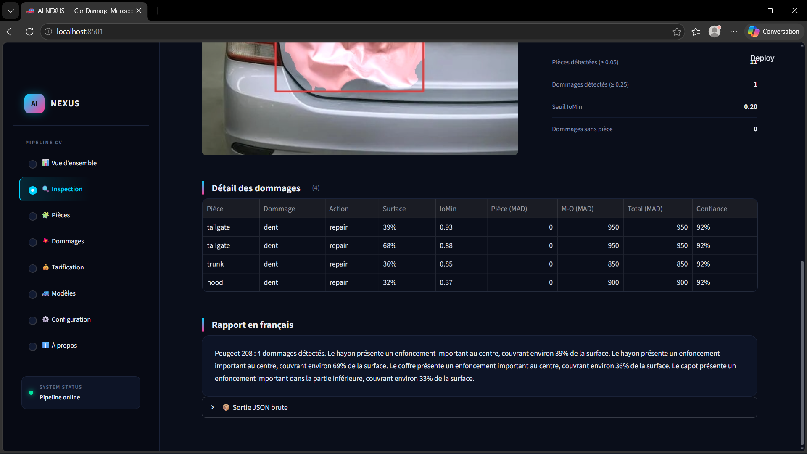
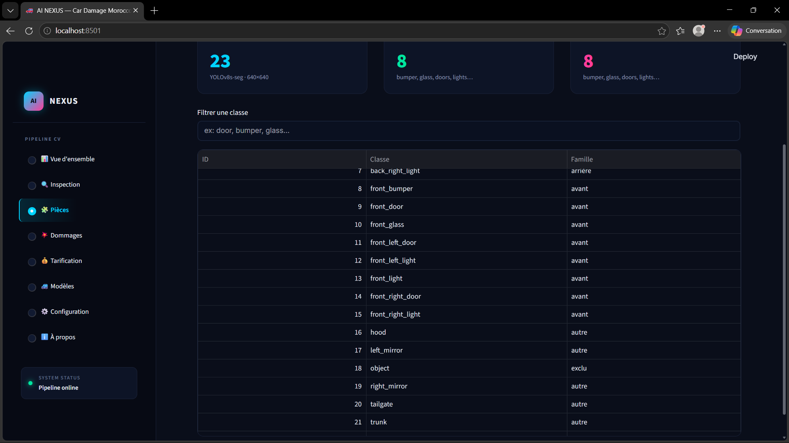
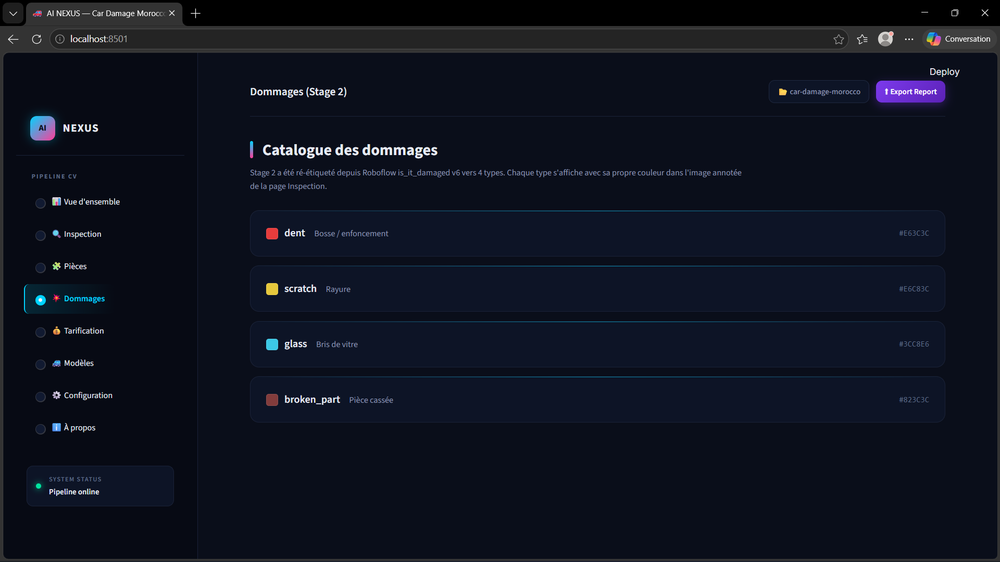
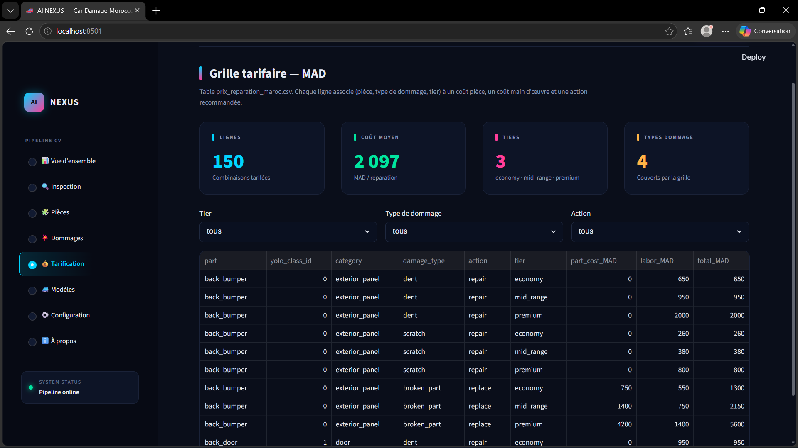
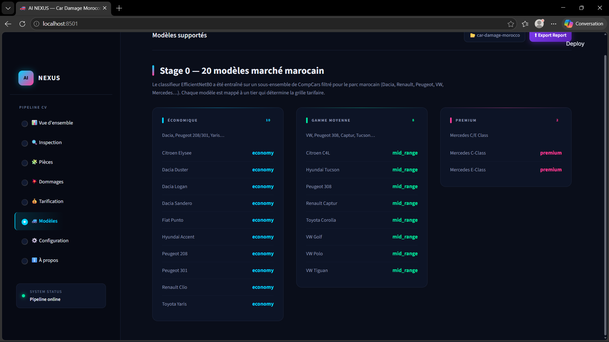
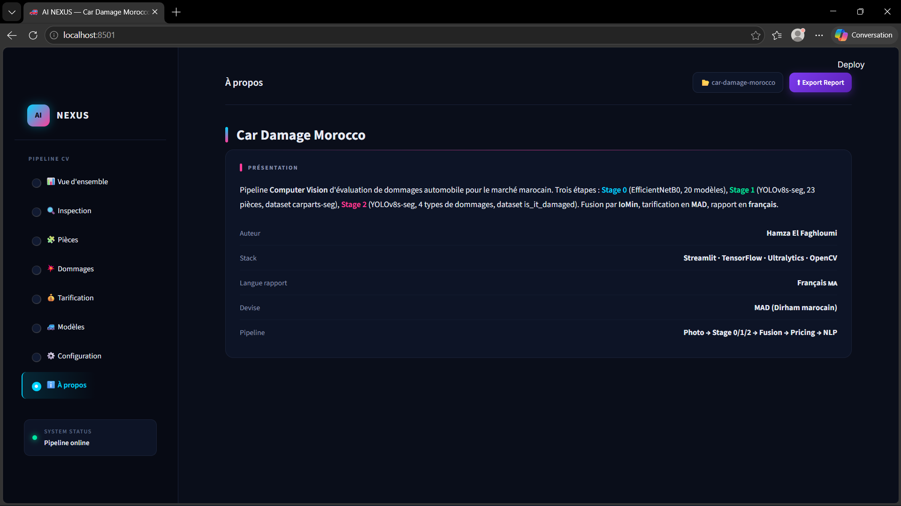

# Streamlit Dashboard

Dark **AI NEXUS** themed interface. 8 pages routed from a left sidebar.

## Run

```bash
python -m streamlit run app/streamlit_app.py
```

Opens on [http://localhost:8501](http://localhost:8501).

---

## Pages

### Vue d'ensemble — Overview



The landing page. Shows at a glance:

- **Pipeline CV** card — whether all 3 weight files are present (✓ présent / ✗ manquant)
- **Base tarifaire** card — number of pricing rows (150), currency (MAD), tiers, source CSV
- Three KPI chips: **20** car models · **23** part classes · **4** damage types

---

### Inspection — Main inference page

This is where you upload a photo and run the full pipeline.



**Parameters expander** (top, collapsible) — 4 controls:

| Control | Default | Effect |
|---|---|---|
| Confiance pièces | 0.25 | Stage 1 detection threshold |
| Confiance dommages | 0.25 | Stage 2 detection threshold |
| Seuil IoMin (fusion) | 0.35 | Min overlap to attach damage to part |
| Modèle de voiture | Détection automatique | Override to skip Stage 0 |

After upload, the page shows **4 KPI cards**:

| Card | What it shows |
|---|---|
| **Véhicule** | Detected car model + confidence (or "Sélection manuelle" if overridden) |
| **Tier de prix** | economy / mid_range / premium badge |
| **Dommages détectés** | Count + how many are certified vs estimated |
| **Coût total** | Sum in MAD (Pièces + main d'œuvre) |

Below the cards: the **annotated image** (damage masks + confidence labels) and a **diagnostic panel** (parts detected, damages detected, IoMin threshold, damages without part).



Further down:

- **Détail des dommages** table — one row per finding: Pièce · Dommage · Action · Surface · IoMin · Pièce (MAD) · M-O (MAD) · Total (MAD) · Confiance
- **Rapport en français** — the full French multi-sentence report generated by the template engine
- **Sortie JSON brute** — collapsible expander with the raw JSON output

---

### Pièces — Parts catalogue



Searchable catalogue of all 23 Stage 1 carparts classes. Filter by typing a keyword (e.g. "door", "bumper", "glass"). Each row shows the class ID, name, and family (avant / arrière / autre / exclu).

---

### Dommages — Damage classes



The 4 Stage 2 damage types with their overlay colors as used in the annotated image:

| Class | French | Color |
|---|---|---|
| `dent` | Bosse / enfoncement | 🔴 `#E63C3C` |
| `scratch` | Rayure | 🟡 `#E6C83C` |
| `glass` | Bris de vitre | 🔵 `#3CC8E6` |
| `broken_part` | Pièce cassée | 🟫 `#823C3C` |

---

### Tarification — Pricing table



Interactive view of `prix_reparation_maroc.csv`. Summary cards at the top:

| Card | Value |
|---|---|
| Lignes | **150** combinations |
| Coût moyen | **2 097 MAD** / repair |
| Tiers | **3** (economy · mid_range · premium) |
| Types dommage | **4** |

Below: filterable table by Tier / Type de dommage / Action. Shows full schema: part · yolo_class_id · category · damage_type · action · tier · part_cost_MAD · labor_MAD · total_MAD.

---

### Modèles — Supported car models



All 20 Stage 0 car models grouped into 3 tier columns:

| Économique (10) | Gamme moyenne (8) | Premium (2) |
|---|---|---|
| Citroen Elysee · Dacia × 3 · Fiat Punto · Hyundai Accent · Peugeot 208/301 · Renault Clio · Toyota Yaris | Citroen C4L · Hyundai Tucson · Peugeot 308 · Renault Captur · Toyota Corolla · VW Golf/Polo/Tiguan | Mercedes C-Class · Mercedes E-Class |

---

### À propos — About



Project credits and stack summary:

| Field | Value |
|---|---|
| Auteur | Hamza El Faghloumi |
| Stack | Streamlit · TensorFlow · Ultralytics · OpenCV |
| Langue rapport | Français MA |
| Devise | MAD (Dirham marocain) |
| Pipeline | Photo → Stage 0/1/2 → Fusion → Pricing → NLP |

---

## Theme

- Background: dark `#0A0E1A`
- Primary accent: cyan `#00D4FF`
- Secondary accent: pink `#FF3D9A`
- Font: Inter
- CSS extracted to `app/static/theme.css`
- Streamlit base theme in `.streamlit/config.toml`

## File structure

```
app/
├── streamlit_app.py        ← routing, helpers, all 8 page functions
└── static/
    └── theme.css           ← dark theme styles

.streamlit/
└── config.toml             ← base dark theme color seed
```
